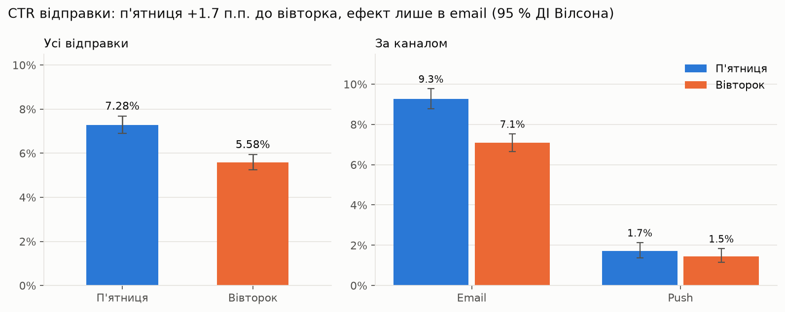
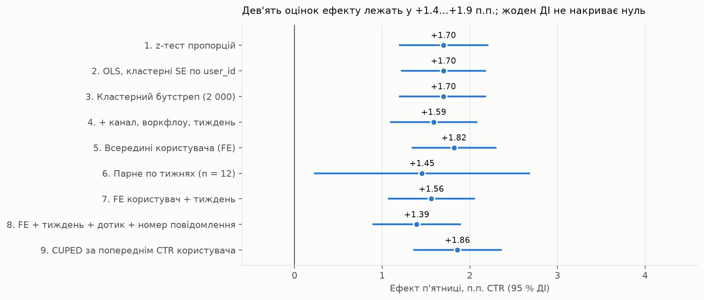
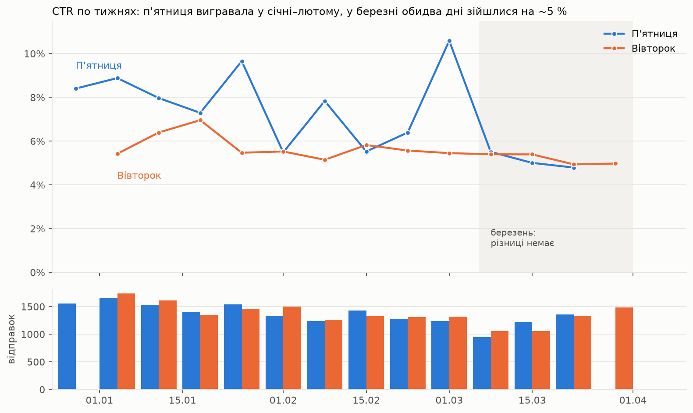
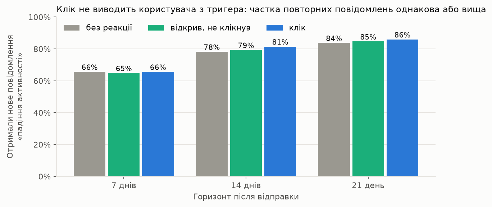
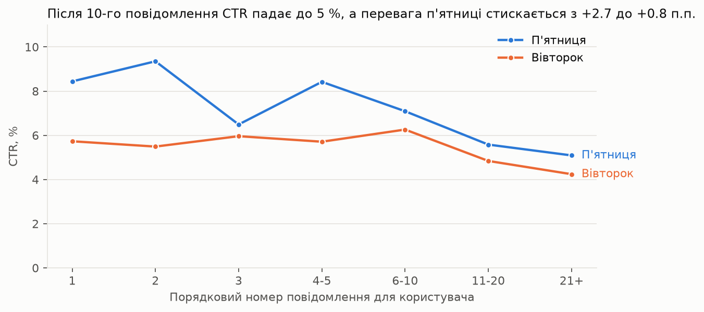
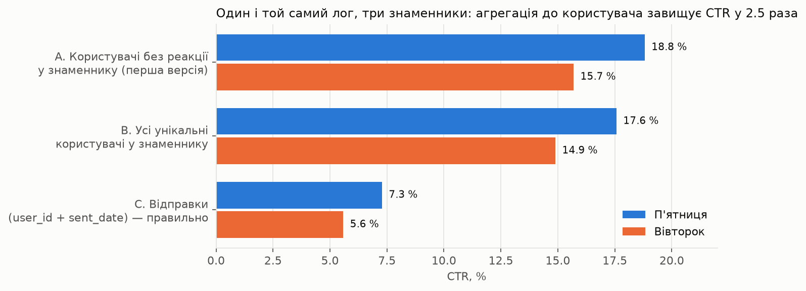

# День розсилки: вівторок чи п'ятниця? Квазіексперимент на тригерних воркфлоу

<details>
<summary><b>English summary</b></summary>

**Question.** A product sends re-activation emails/pushes to users whose activity drops, on Tuesday or Friday. Which day should stay?

**Data.** 41,925 log rows (Jan–Mar 2021) → 35,527 unique sends (user × send timestamp × channel), 4,578 users.
The log is a LEFT JOIN of sends to actions, so the unit of analysis is a *send*, not a user; aggregating to users inflates CTR 2.5×.

**Result.** Friday CTR 7.28 % vs Tuesday 5.58 %: +1.70 pp (95 % CI 1.19–2.21), +30 % relative, p < 0.001.
Robust across six estimators (z-test, user-clustered SE, cluster bootstrap, covariate-adjusted, within-user fixed effects, weekly pairing).

**Why it is not a final decision.** Not a randomized split but trigger-based workflows (78.5 % of users saw both days);
day is confounded with send hour (14:00 vs 16:00) and 71 % of Friday's edge comes from weekend clicks; the effect vanished in March;
CTR is a proxy — a click does not stop the user from re-entering the "activity dropped" trigger (65.6 % vs 65.6 % within 7 days);
no holdout group, so incremental re-activation is unknown.

**Recommendation.** Friday as a temporary default; run a clean user-randomized test (two days, same send hour) with a 10 % holdout,
primary metric = return to activity within 7–14 days, CTR secondary. Clicks cluster within users (ICC 0.22, design effect 2.5),
so the test needs ~22k sends per arm, about 16 weeks at current volume.

**Stack.** Python (pandas, scipy, statsmodels), SQL (DuckDB; BigQuery-compatible), matplotlib, Jupyter.
</details>

Аналіз логу реактиваційних розсилок (email + push) за січень–березень 2021: 41 925 подій, 35 527 відправок, 4 578 користувачів.
Питання бізнесу: **який день відправки лишити — вівторок чи п'ятницю?** Успіх у постановці задачі = клік за посиланням.

> **Відповідь коротко.** П'ятничні відправки клікають частіше: 7.28 % проти 5.58 % (+1.70 п.п., 95 % ДІ 1.19–2.21, +30 %, p < 0.001),
> і це не шум. Але закріплювати п'ятницю назавжди на цих даних не можна: це не рандомізований тест, а тригерні воркфлоу;
> день змішаний із часом відправки; ефект зник у березні; CTR — проксі, а ознак реактивації від кліку в логу не видно;
> holdout-групи немає. Рішення: п'ятниця як тимчасовий дефолт + чистий тест із рандомізацією по користувачу, holdout
> і метрикою повернення активності.



## Що доведено

| | П'ятниця | Вівторок |
|---|---|---|
| Відправок (спостережень) | 17 710 | 17 817 |
| Відправок із кліком | 1 290 | 995 |
| **CTR** | **7.28 %** | **5.58 %** |
| 95 % ДІ Вілсона | 6.91–7.68 % | 5.26–5.93 % |

* **Одиниця спостереження — відправка** (`user_id + sent_date + канал`), а не користувач. Лог — це LEFT JOIN відправок до дій:
  рядок із порожнім `action_type` — відправка без реакції, рядки `opened`/`click` — дії за тією ж відправкою. Агрегація до користувача
  завищує CTR у 2.5 раза (18.8 % замість 7.3 %) і роздуває різницю між днями з 1.7 до 3.1 п.п.
* **Дизайн перевірено:** групи збалансовані (SRM p = 0.57), склад за каналом і воркфлоу однаковий, призначення дня не залежить від
  попередньої реакції (54.5 % vs 55.4 %), MDE при 80 % потужності — 0.7 п.п.
* **Стійкість:** z-тест, OLS з кластерними SE по користувачу, кластерний бутстреп, поправка на канал/воркфлоу/тиждень,
  порівняння всередині користувача (fixed effects), парне порівняння по 12 тижнях, двосторонні FE (користувач + тиждень: +1.56 п.п.)
  і двосторонні FE з поправкою на попередній дотик і номер повідомлення (+1.39 п.п., найконсервативніша оцінка), а також
  **CUPED** за CTR користувача на попередніх відправках (+1.86 п.п.) — дев'ять оцінок у діапазоні +1.4…+1.9 п.п.
  CUPED тут показовий тим, що **не допомагає**: коваріата корелює з кліком (r = 0.31, теоретично −9 % дисперсії), але
  кластерна SE не зменшується, бо користувацьку інформацію вже забирає кластеризація; при повторних відправках одному
  користувачу працюють fixed effects, а CUPED потрібен там, де одиниця рандомізації = одиниця спостереження.
* **Множинні порівняння:** сегментні тести — пошукові; після поправки Холма жоден висновок не змінюється. Тести на взаємодію
  показують, що ефект дня різний між каналами і періодами, однаковий між воркфлоу і наявністю попереднього дотику.
* **Інтерференцію перевірено:** у 38 % користувач-тижнів п'ятничний лист є «другим дотиком» після вівторкового. Ефект однаковий
  із попереднім повідомленням за останній тиждень і без нього (+1.69 vs +1.75 п.п.), у тижнях з одним днем і з обома (+1.74 vs +1.67 п.п.),
  взаємодія «день × попередній дотик» дорівнює нулю (p = 0.92). Послідовність дотиків не пояснює результат.



## Чого дані не доводять

| Проблема | Що це означає для рішення |
|---|---|
| **Не рандомізований A/B, а тригерні воркфлоу:** 78.5 % користувачів бачили обидва дні, 38 % користувач-тижнів — обидва дні за один тиждень | Порівняння спостережне; «день впливає на клік» — гіпотеза з сильною підтримкою (селекції та інтерференції не знайдено), не доведений причинний ефект |
| **День змішаний із часом:** вівторок о 14:00, п'ятниця о 16:00–17:00; 71 % переваги п'ятниці — кліки в наступні дні (40 % п'ятничних кліків — субота–неділя) | «П'ятниця» може бути «вихідними попереду» або «кінцем робочого дня»; з цих даних не розділити |
| **Ефект зник у березні** (5.1 % vs 5.1 %, p = 0.86) і відсутній у push (1.7 % vs 1.5 %, p = 0.30) | Сезонність або вигорання; постійне рішення на основі січня–лютого ризиковане |
| **CTR — проксі, мета — реактивація.** Клік не виводить користувача з тригера «падіння активності»: через 7 днів нове повідомлення отримують 65.6 % клікерів і 65.6 % неклікерів | Навіть якщо п'ятниця дає більше кліків, невідомо, чи дає вона більше повернень у продукт |
| **Немає holdout-групи** | Невідомо, чи розсилка взагалі реактивує, чи люди повернулися б самі (канібалізація органічного повернення) |





## Рішення і дизайн чистого тесту

**Питання 1.** Не закріплювати п'ятницю назавжди. Якщо один день потрібен уже зараз — п'ятниця як **тимчасовий дефолт до
результатів тесту**: за 13 тижнів вівторок жодного разу не виграв значуще, найгірший випадок для п'ятниці — паритет. Вибір одного
дня також зменшує частоту з 1.72 до 1.25 повідомлень на користувача за тиждень (−28 %), що з огляду на втому саме по собі
підвищить CTR окремої відправки незалежно від дня.

**У цифрах для бізнесу.** +1.70 п.п. — це +170 кліків на кожні 10 000 відправок, або ≈ +600 кліків за квартал при поточних
обсягах (35.5 тис. відправок), якщо ефект січня–лютого збережеться. У березневому режимі приріст дорівнює нулю. І це кліки,
а не повернення користувачів: скільки з них реактивація, без holdout сказати не можна.

**Чистий тест:**

* рандомізація по `user_id`, стратифікація за каналом і воркфлоу, одна гілка на користувача на весь тест;
* дві гілки: вівторок і п'ятниця в один і той самий час; час відправки — окремим наступним тестом, бо повний 2×2 при
  кластеризації по користувачу тривав би ~32 тижні;
* holdout 10 % без розсилок — інкрементальний ефект розсилки як такої;
* первинна метрика — повернення активності за 7 і 14 днів відносно holdout; CTR — вторинна; гардрейли — відписки, скарги, відключення push;
* тривалість з урахуванням кластеризації по користувачу (ICC = 0.22, design effect ≈ 2.5): MDE 1 п.п. по CTR ≈ 22 тис.
  відправок на гілку, ~16 тижнів для двох гілок; розрахунок для незалежних відправок дав би 9 тис. і 7 тижнів, але для
  рандомізації по користувачу він неправильний; зупинка за планом.

## Що ще знайшлося в даних (питання 2)

| Спостереження | Рекомендація |
|---|---|
| Email дає CTR 8.2 %, push — 1.6 %; у push немає подій відкриття | Push — доповнення до email; налагодити трекінг відкриттів push |
| CTR падає з 7.2 % на 1-му повідомленні до 4.6 % після 20-го; 26 % відправок ідуть людям з 10+ повідомленнями | Ліміт частоти; після 3–4 повідомлень без реакції — пауза або зміна креативу |
| Загальний CTR за квартал впав з ~8 % до ~5 % | Ротація контенту, тест теми/тексту |
| 79 % кліків у першу добу, 94 % — за 72 години, медіана 5 год | Вікно атрибуції 72 год |
| Після кліку у вівторок п'ятничне повідомлення того ж тижня клікають 33.6 % (без кліку — 5.2 %) | Не надсилати тим, хто вже повернувся; окремо працювати з тими, хто не реагує ніколи |
| 18 користувачів з ≥ 30 кліками, до 111 за один лист; 19 лютого push дав 0 кліків із 363 | Фільтр ботів/сканерів до розрахунку метрик; моніторинг трекінгу push |
| Клік не виводить із тригера; holdout немає | Постійний holdout 5–10 % і метрика інкрементального повернення замість кліку |



**Поведінкові дані, яких бракує:** активність після розсилки (сесії, платежі за 7/30 днів vs holdout), стан користувача на момент
відправки (днів від останньої активності, LTV), історія комунікацій (скільки повідомлень поспіль проігноровано), час і пристрій
активності, негативні сигнали (відписки, скарги, bounce), глибина реакції (час читання, повторні відкриття).

## Структура репозиторію

```
ab_test_mailing_day/
├── README.md                        <- цей звіт
├── notebook/ab_test_analysis.ipynb  <- повний аналіз з коментарями (виконаний, з виводами); поруч .html-версія
├── src/abtools.py                   <- статистичні функції: z-тест, ДІ, SRM, MDE, кластерний бутстреп, within-user FE, парні тижні
├── tests/test_abtools.py            <- 16 тестів: чисті функції на відомих значеннях, синтетичні панелі, CUPED, інтеграційний тест на реальному лозі
├── sql/                             <- SQL-запити (DuckDB / PostgreSQL, з примітками для BigQuery)
│   ├── 00_explore.sql               <- структура логу, розклад відправок
│   ├── 01_observations.sql          <- таблиця спостережень (відправка = рядок)
│   ├── 02_ab_test_by_day.sql        <- CTR по днях, різниця, ДІ, z-статистика
│   ├── 03_segments.sql              <- канал x день, воркфлоу x день
│   ├── 04_weekly.sql                <- динаміка по тижнях
│   ├── 05_fatigue.sql               <- CTR за порядковим номером повідомлення
│   ├── 06_data_quality.sql          <- аномалії, боти, час до кліку
│   ├── 07_wrong_vs_right.sql        <- чому агрегація до користувача завищує CTR
│   └── 08_overlap.sql               <- перетин груп і перевірка селекції
├── img/                             <- графіки, які генерує ноутбук
├── data/mailing_events.csv          <- вихідний лог (41 925 рядків)
├── requirements.txt
└── LICENSE                          <- MIT
```

## Метод (коротко)

**Гіпотези.** H0: CTR(п'ятниця) = CTR(вівторок); H1: CTR різні (двосторонній тест), α = 0.05. Первинна метрика — CTR відправки,
вторинні — open rate і CTOR (лише email). План аналізу зафіксовано до розрахунків (розділ 0 ноутбука); тест не «підглядався»,
дані взяті за весь період одразу.

1. **Структура логу.** Доведено, що рядки з `action_type IS NULL` — відправки без реакції (для дій немає парного NULL-рядка). Звідси 35 527 спостережень.
2. **EDA.** Розклад (день і година), обсяги по тижнях/каналах/воркфлоу, повідомлень на користувача, перетин груп, перевірка селекції, якість даних.
3. **Дизайн.** SRM (χ²), баланс складу груп, потужність і MDE.
4. **Тест.** Двовибірковий z-тест пропорцій, ДІ Вілсона, різниця з ДІ, відносний ефект, OR з логіту.
5. **Стійкість.** Кластерні SE по користувачу, кластерний бутстреп (2 000), поправка на коваріати, within-user fixed effects, парне порівняння по тижнях, виключення ботів.
6. **Розрізи й динаміка.** Канал, воркфлоу, тижні, січень–лютий vs березень.
7. **Межі метрики.** Проксі реактивації через повторний тригер, розклад кліків по днях тижня, вплив рішення на частоту.

## Відтворення

```bash
pip install -r requirements.txt
python -m pytest tests
jupyter nbconvert --to notebook --execute notebook/ab_test_analysis.ipynb --output ab_test_analysis.ipynb
```

SQL-запити виконуються в DuckDB прямо над CSV (`CREATE VIEW events AS SELECT * FROM read_csv_auto('data/mailing_events.csv')`);
для BigQuery потрібні заміни, зазначені в коментарях до файлів (`DATE_TRUNC`, `TIMESTAMP_DIFF`).

## Обмеження

Немає даних про рандомізацію, логіку тригерів, контент повідомлень, holdout-групу та активність після розсилки. Висновок про день —
статистично сильний, але спостережний і лише про клік; чи повертають розсилки активність і який день повертає її краще,
з цих даних оцінити не можна.

План аналізу (гіпотези, метрика, одиниця спостереження, SRM, MDE, z-тест, кластерні оцінки, розрізи) зафіксовано до розрахунків.
Перевірка інтерференції, двосторонні FE, поправка Холма, проксі реактивації, аналіз часу кліків і частоти додані після зовнішнього
рев'ю: це пошукові доповнення, вони не змінили основний результат, і в ноутбуці (9.7) це зазначено прямо.


